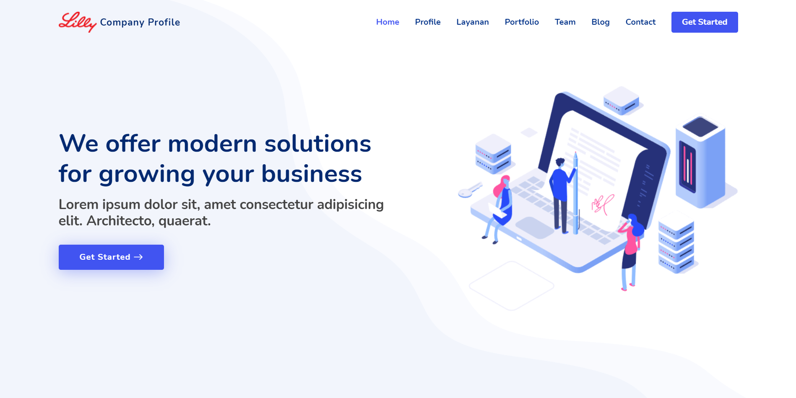
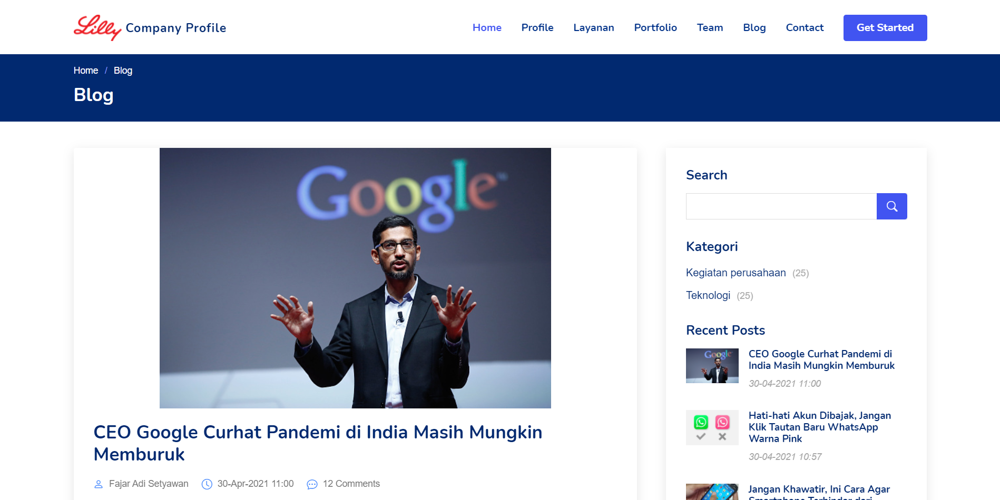

# Company Profile Web App - CodeIgniter 4

Aplikasi web Company Profile berbasis CodeIgniter 4. Project ini dirancang untuk menampilkan informasi perusahaan, layanan, portofolio, berita, staff, dan fitur manajemen user secara lengkap dan mudah digunakan.

## Kredit & Sumber Asli

Project ini merupakan hasil migrasi dan pengembangan dari project CodeIgniter 3 milik [Fajar Adi Setyawan](https://github.com/FajarAdiSetyawan/Company-Profile). Seluruh hak cipta dan kredit untuk versi awal (CI3) tetap milik pemilik aslinya.

## Instalasi
- `git clone `
- `composer install`
- Rename file `env` menjadi `.env`, kemudian lakukan penyesuaian konfigurasi Database di file `.env` tersebut
- Jalankan syntax `php spark migrate` untuk melakukan migrasi database
- Jalankan syntax `php spark db:seed AllSeed` untuk melakukan seeding data awal
- Jalankan syntax `php spark serve` untuk menjalankan aplikasi

## Screenshot

#### Front End (Home)

     

#### Front End (Berita/Artikel)

     

#### Back End (Login)

     

#### Back End (Dashboard)

     

## Fitur Utama

- **Landing Page Dinamis**: Menampilkan informasi perusahaan, layanan, portofolio, dan berita terbaru.
- **Manajemen Berita**: CRUD berita dengan kategori.
- **Manajemen Layanan**: CRUD layanan yang ditawarkan perusahaan.
- **Manajemen Portofolio**: CRUD portofolio proyek/klien.
- **Manajemen Klien**: CRUD data klien.
- **Manajemen Staff**: CRUD data staff/karyawan.
- **Manajemen User**: Registrasi, login, profile, ganti password, dan hak akses.
- **Halaman Dashboard**: Statistik dan ringkasan data penting.
- **Autentikasi & Otorisasi**: Sistem login, logout, dan filter akses halaman.
- **Pengaturan Website**: Update profil perusahaan, kontak, dan sosial media.
- **404 Custom Page**: Halaman error khusus jika halaman tidak ditemukan.

## Struktur Folder Penting

- `app/Controllers/` : Controller utama (Home, Auth, Dashboard, Berita, Client, Portofolio, Staff, User, dll)
- `app/Models/` : Model untuk akses database (M_berita, M_client, M_portofolio, dll)
- `app/Views/` : Template tampilan frontend & backend
- `public/assets/` : Asset gambar, css, js
- `app/Helpers/` : Helper custom untuk berbagai kebutuhan
- `app/Config/Routes.php` : Konfigurasi routing aplikasi

## Kebutuhan Server

- PHP 8.1+
- Ekstensi PHP: intl, mbstring, json, curl, mysqlnd (jika pakai MySQL)
- Composer

## Kontribusi

Pull request dan issue sangat terbuka untuk pengembangan lebih lanjut.